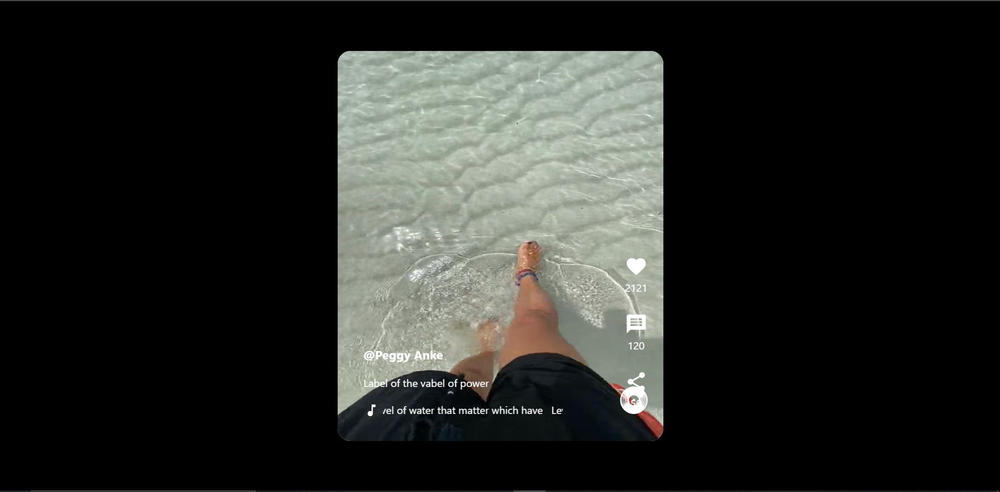

# Tiktok-clone

Preview



Tiktok app clone..Developed with mern stack(mongodb,express,react,node).This is a very basic mern stack app.all the data is accesed from mongodb database.

## Backend

### Execute backend

Access to backend folder

```
cd tiktok/backend
```

Install dependencies
```
npm install
```

Run application
```
npm run start
```

## Frontend

### Execute frontend

Access to frontend folder

```
cd tiktok/frontend
```

Install dependencies
```
npm install
```

Build application
```
npm run build
```

Run application
```
npm run start
```